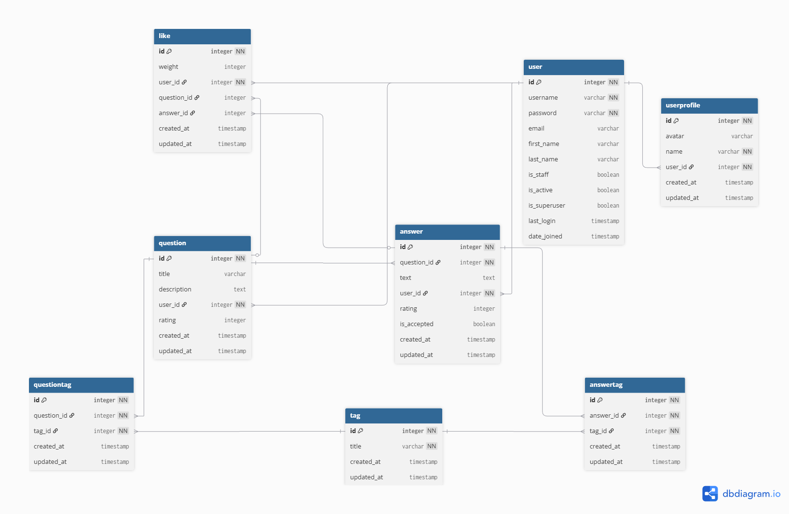

# QuickAnswer

Веб-приложение на Django с системой вопросов и ответов.

## Технический стек

- Python 3.12.3
- Django 5.2.7
- PostgreSQL 15
- Docker 🐳
- psycopg2-binary

## Архитектура проекта



## Быстрый запуск

### Перед запуском необходимо создать .env на основе примера

```bash
cd VK_WEB_1sem

# При необходимости переключиться на нужную ветку
# git checkout <имя ветки>

# Создаём .env
cp .env.example .env
```

### Запуск через Docker Compose:

```bash
# Сборка и запуск
docker compose up -d --build

# Заполнение базы данных
docker-compose exec web python manage.py fill_db 100

# Остановка
docker compose down

# Просмотр логов
docker compose logs -f web
```

### Если после изменения .env приложение не подключается к БД, контейнеры нужно пересоздать

```bash
docker-compose down -v
docker-compose up -d --build
```

### Другие полезные команды
```Bash
# Выполнение миграций
docker-compose exec web python manage.py migrate

# Заполнение базы данных
docker-compose exec web python manage.py fill_db 100

# Создание суперпользователя
docker-compose exec web python manage.py createsuperuser
```

## Доступ к приложению

- Веб-приложение: [http://localhost:8000](http://localhost:8000)
- Админ-панель: [http://localhost:8000/admin](http://localhost:8000/admin)
